# Project "Balance" by Oopsie

**Team:** Foo Jing Yu, Lim Xin Ying, Ang Le Ying

**Problem Statement:** Stress & Workload Manager

**Video Presentation:** [Unlisted Youtube Link]

**Presentation Slides:** [[Presentation slides]](https://docs.google.com/presentation/d/1dFjj56bjBWYIRlOUaWHr1rwgzEfsEC8T/edit?usp=drive_link&ouid=103306664888905290630&rtpof=true&sd=true)

## 1. Project Overview

### The Problem:
University students often manage many responsibilities at the same time. These responsibilities do not only come from academic work, but also from part-time jobs, social commitments, personal errands and the need for physical and mental recovery.

The problem is that these responsibilities are usually managed separately. A student may use a calendar for classes, a to-do list for assignments and reminders for personal tasks, but still have no clear picture of how much they are carrying overall. This makes it difficult to recognise overload early and decide which commitments should be prioritised, postponed, reduced or rescheduled.

#### A. Causes

The main causes identified are:

- Multiple academic responsibilities
- Part-time work
- Social commitments
- Daily errands
- Physical demands and lack of recovery
- Poor visibility of overall workload
- Difficulty prioritizing competing commitments

When these responsibilities accumulate, students may know that they feel busy or stressed but may not clearly understand what is creating the pressure or what they can realistically change.

#### B. Stakeholders

**Primary stakeholder**

- University students

**Secondary stakeholders**

- Friends and family
- Part-time employers
- Universities and lecturers
- Project teammates

The application mainly focuses on university students because they are the users who need to make everyday decisions about deadlines, study time, work, personal responsibilities and recovery.

#### C. Existing Solutions

**Todoist**

Todoist is mainly designed around task organisation and productivity. It can help users record and complete tasks, but it does not focus on understanding the student's overall workload across mental, physical, social and daily responsibilities.

**Finch**

Finch focuses more strongly on self-care and wellbeing activities. However, it does not mainly address the responsibilities and commitments that may be creating the student's workload in the first place.

The gap identified is therefore not simply a lack of another planner or wellbeing application. Students need a way to connect workload, stress, scheduling and recovery in one system.

### Our Solution:

Our solution is a student-focused workload management app "Balance" that helps users understand their overall workload across different areas of life. Instead of only tracking tasks, the app analyses workload, stress and available capacity to identify potential overload. An AI assistant helps students prioritize, reschedule and rebalance commitments when their workload becomes too high. The app also encourages recovery through rewards, achievements and short mini-games, making workload management more engaging without promoting excessive productivity.

### Core Features:

| Feature | Description |
| --- | --- |
| **Workload Dashboard** | Visualizes overall workload across Mental, Time, Physical, Social and Errands. |
| **Tasks & Commitments** | Records academic, work, social and personal commitments with deadlines, estimated duration, priority and fixed/flexible status. |
| **Stress Tracker** | Tracks stress levels and possible causes to identify changes in stress over time. |
| **AI Workload Assistant** | Analyses workload, helps prioritize tasks and provides personalized management suggestions through a friendly pet persona. |
| **Load Balancer** | Suggests moving, postponing or reducing lower-priority commitments when workload becomes too high. |
| **Recovery System** | Encourages planned rest, sleep, breaks and other recovery activities. |
| **Balance Points** | Rewards healthy workload management and recovery rather than simply completing more tasks. |
| **Rewards & Achievements** | Use points to unlock assistant cosmetics and achievements for maintaining balance. |
| **Mini Games** | Provides short, casual activities for relaxation during breaks. |
| **What-If Simulator** | Shows how adding or changing a commitment could affect the student's overall workload. |

### Expected Impact:

The application aims to help students recognise excessive workload earlier and make more realistic decisions before their schedule becomes difficult to manage.

Instead of only helping students answer **"What do I need to complete?"**, the system also helps them understand:

      What is creating most of my workload? → What can I change? → When should I recover?

By combining workload visibility, stress awareness, schedule rebalancing and recovery support, Balance is intended to help students make better decisions about their commitments rather than simply encouraging them to complete more tasks.

The expected impact is improved workload awareness, more realistic prioritisation, healthier scheduling decisions and better recognition of the need for recovery.

## 2. Ideation & Process
### 2.1 Ideas We Considered

Several directions were considered before combining the strongest elements into Balance:

| Idea | Why it was dropped / kept |
|---|---|
| **A. Stress & Workload Manager (Chosen)** | Selected because it directly addresses the main problem by combining workload visibility, stress awareness, workload rebalancing and recovery support. |
| **B. Customizable AI Companion & Workload Assistant (Chosen / Integrated)** | Kept because personalized AI guidance can help students understand their workload and decide what actions to take. It was integrated into the final app rather than developed as a standalone product. |
| **C. Smart Student Planner** | Dropped as a standalone concept because it mainly focuses on tasks, schedules and productivity, making it too similar to existing planner and to-do apps. |
| **D. Stress Tracking App** | Dropped as a standalone concept because it can identify stress levels and causes but does not directly help students reduce or rebalance their workload. |
| **E. Recovery & Wellness App** | Dropped as a standalone concept because it focuses on rest and wellness but does not address the responsibilities that are causing students to become overloaded. |
| **F. Virtual Pet & Garden** | Refined as a supporting feature because the full pet and garden concept would make the app too focused on gaming. The pet was kept as AI assistant, while the garden feature was dropped. |

### 2.2 Ideation Boards
 
Before deciding on the final concept, we first broke down the problem to understand what actually contributes to student overload. We then looked at the main causes and compared different solution directions before deciding which ideas should be kept, changed or removed.

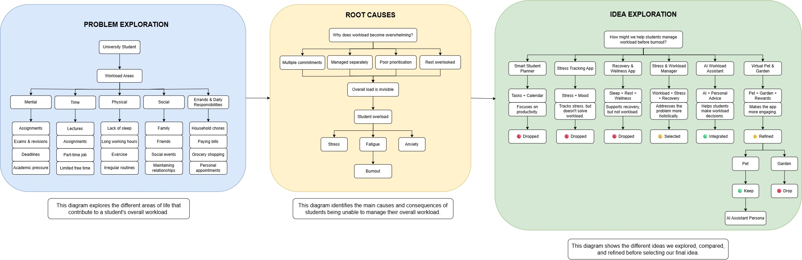

**Figure 1: Ideation Process**

#### Problem Exploration:

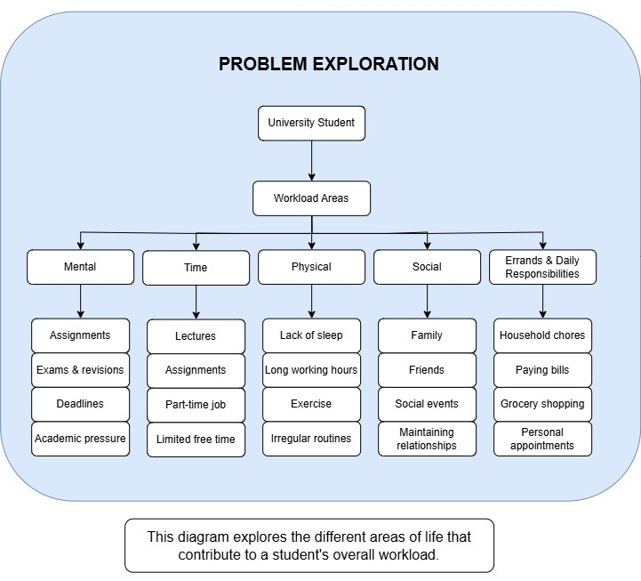

**Figure 2: Problem Exploration**

We first mapped the different areas that contribute to a student's workload. This showed that overload is not caused by academic work alone, as part-time work, social commitments, physical needs and daily responsibilities also compete for the student's time and energy.

#### Root Cause Analysis:

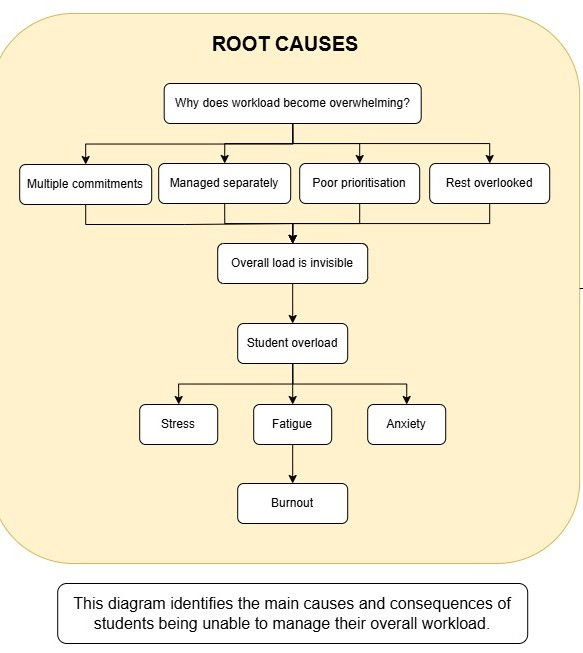

**Figure 3: Root Cause Analysis**

We then looked at why these responsibilities become difficult to manage. The problem was not only having too many commitments, but also managing them separately, having unclear priorities and leaving too little time for recovery.

#### Idea Exploration:

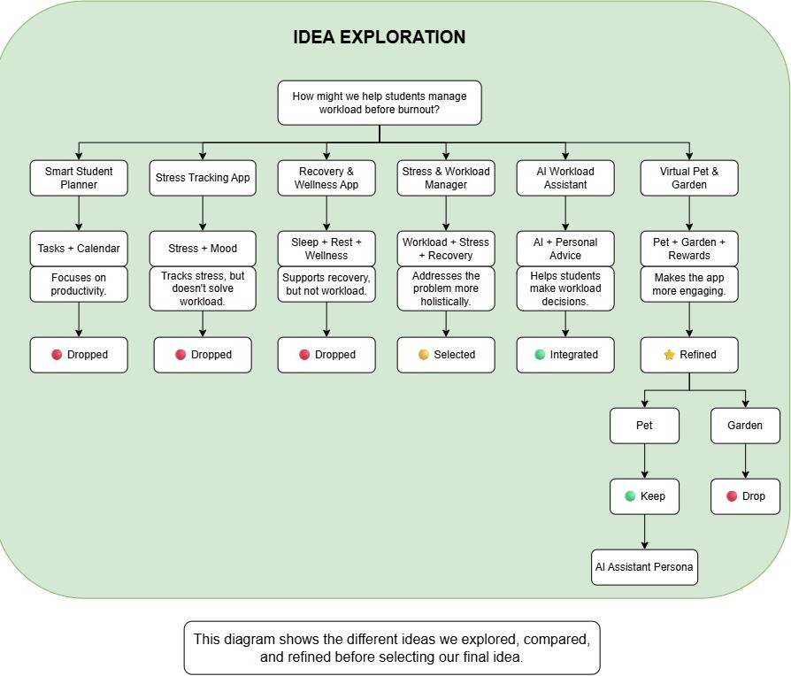

**Figure 4: Idea Exploration**

Several possible solutions were compared instead of choosing the first idea. A planner, stress tracker and recovery app each solved only one part of the problem, so the Stress & Workload Manager became the main direction. The AI assistant was integrated to support prioritisation and rebalancing, while the virtual pet idea was simplified into Milo's persona rather than becoming a separate game.

### 2.3 Mentor Consultation
   
| Date | Mentor | Feedback Received | What Was Changed |
|---|---|---|---|
| 13/09/2026 | Jannelle Tan | Recommeded that more UI/UX design can be applied. | Improved visual design by refining the visual details, layout and overall consistency. |
| 13/09/2026 | Jannelle Tan | Suggested strengthening the customization of the virtual pet to make the solution more distinctive. | Expanded the virtual pet concept with customisation options and connected pet rewards to the user's workload and recovery progress. |
| 13/09/2026 | Jannelle Tan | Suggested removing the AI assistant if the feature scope was too broad. | The AI assistant was retained as it supports personalized workload management. 
| 13/09/2026 | Jannelle Tan | Found the overall concept and prototype good and clear, with no major confusion when navigating it. | - |

## 3. Design & Prototype

**UI Prototype:** [[ Balance Prototype ]](https://draw-prime-09291226.figma.site/)

### Key Screens:

#### Screen 1 - Home Dashboard:

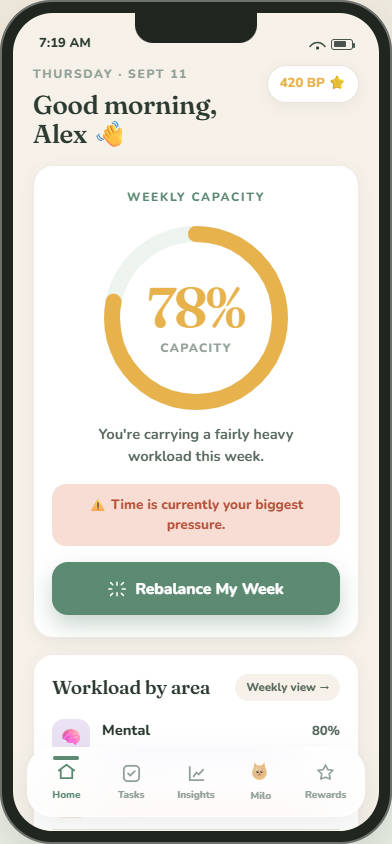
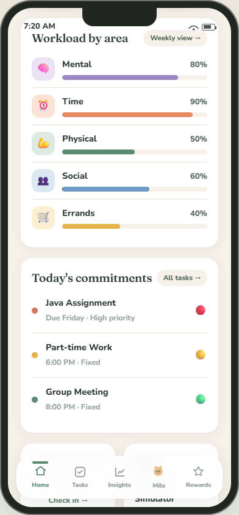
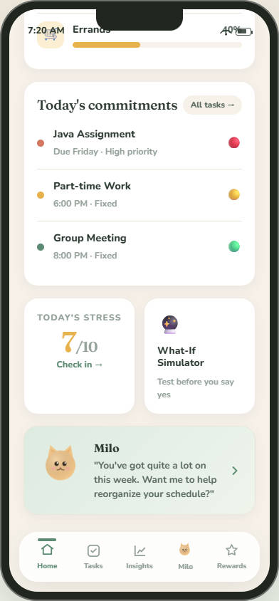

The Home Dashboard gives students an immediate overview of their weekly capacity, major workload areas, current pressure and important commitments. The **Rebalance My Week** action provides a direct path from understanding workload to taking action.

#### Screen 2 - Task & Commitments:

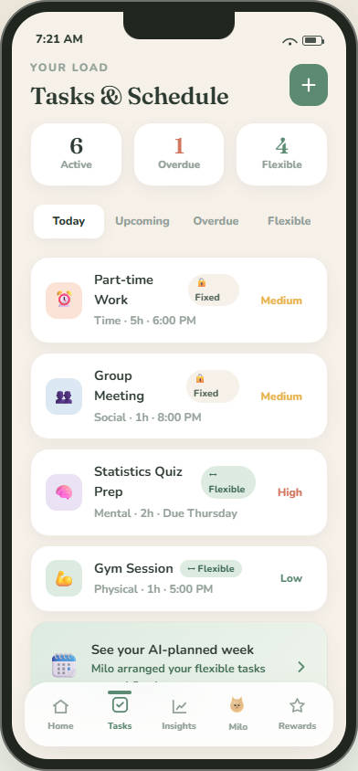

Students record academic and non-academic commitments together with their priority, estimated duration, deadline and fixed or flexible status. This information allows the system to distinguish between commitments that must remain and those that may be rescheduled.

#### Screen 3 - Stress & Workload Insights:

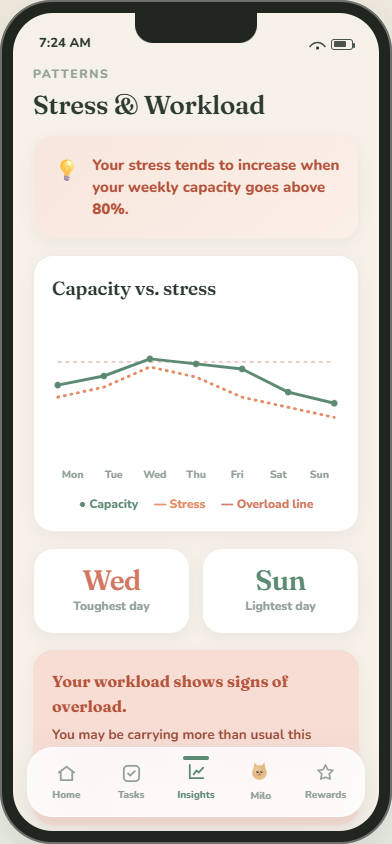

The Insights screen helps students understand changes in their workload and stress over time. Instead of presenting the information separately, the system highlights possible patterns between workload levels and the student's check-ins.

#### Screen 4 - Load Balancer:

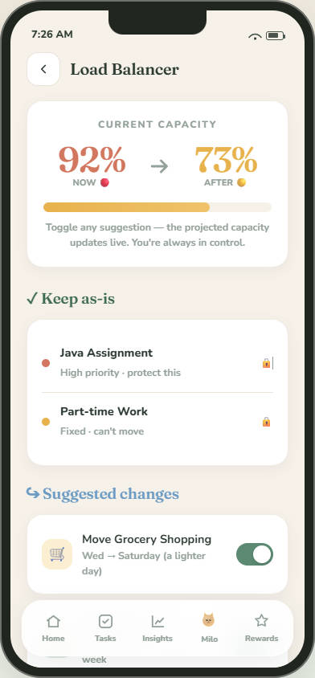
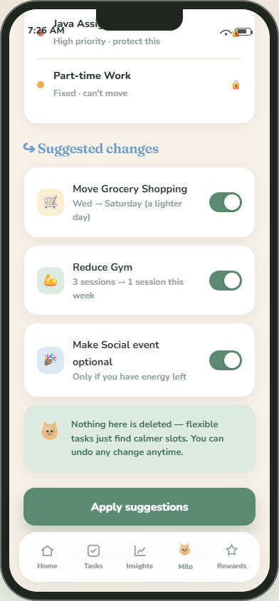

When the user's workload becomes high, the Load Balancer identifies possible changes and groups commitments into **Keep, Move, Reduce and Optional** actions. A before-and-after capacity estimate helps the student understand the possible effect before applying any suggestion.

#### Screen 5 — AI Assistant (Milo):

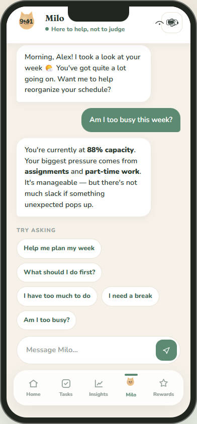

Milo provides personalised workload support through a friendly AI persona. It can help users understand their workload, prioritise commitments, plan their schedule and explain possible rebalancing actions.

#### Screen 6 — Balance Points & Rewards:

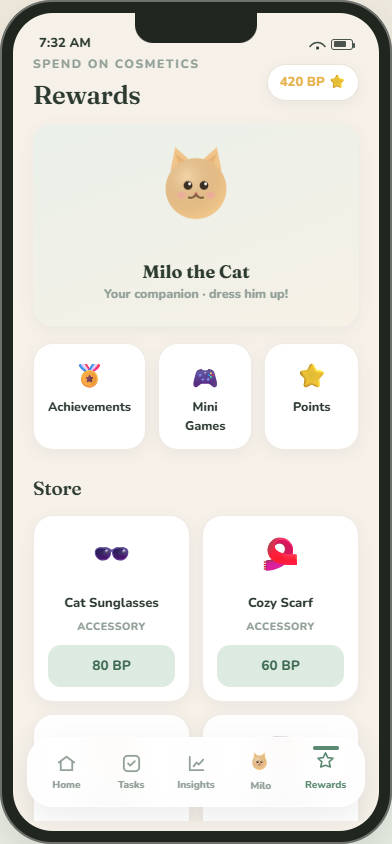
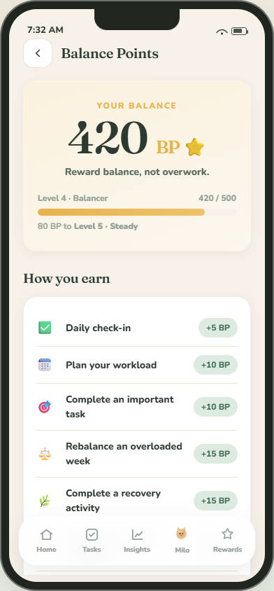

Balance Points reward healthy workload decisions, including recovery and successful rebalancing, rather than only rewarding task completion. Points can be used for optional cosmetic rewards and Milo customisation.

## 4. What Makes It Different

### Our Key Differentiators:

| Feature | What makes it different? |
| --- | --- |
| **Overall Workload Visualiser** | Shows workload across Mental, Time, Physical, Social and Errands, instead of only counting tasks. |
| **What-If Simulator** | Lets students test a new commitment and see how it may affect their overall workload. |
| **Customizable AI Companion & Workload Assistant** | Provides personalized advice based on the student's workload, stress and commitments. Which is also interactive. |
| **Balance-Based Rewards** | Rewards rest, recovery and healthy workload management, rather than only rewarding productivity. |

Unlike traditional productivity apps, our solution focuses on balancing the student's overall life load, not simply completing more tasks.

| Capability | Todoist | Finch | Balance |
| --- | ---: | ---: | ---: |
| Task management | ✓ | Limited | ✓ |
| Stress tracking | — | ✓ | ✓ |
| Overall life workload | — | — | ✓ |
| Fixed / flexible commitment analysis | — | — | ✓ |
| Load balancing | — | — | ✓ |
| Recovery support | — | ✓ | ✓ |
| What-If workload simulation | — | — | ✓ |
| AI workload planning | — | — | ✓ |
| Rewards focused on healthy balance | — | — | ✓ |

## 5. Technical Architecture & Feasibility

### Proposed Tech Stack:
| Layer | Technology | Why We Chose It | Expected Constraints |
| --- | --- | --- | --- |
| **Frontend** | React Native + Expo | Allows us to build a mobile app for both Android and iOS efficiently. | Some native functions and platform-specific behaviour may require additional testing on both Android and iOS. |
| **Backend** | Supabase | Provides authentication, database and backend services in one platform. | The free tier has usage limits, so the prototype needs to keep backend requests and storage within the available quota. |
| **Database** | PostgreSQL (Supabase) | Stores users, tasks, stress records, workload data and rewards. | The data structure needs to be kept simple enough for the limited development time, especially when linking tasks, workload and stress records. |
| **AI** | OpenAI API | Provides personalized workload analysis and suggestions through the AI assistant. | API usage may involve cost and response limits. AI suggestions may also not always match the user's real situation, so users must review suggestions before applying changes. |
| **Charts** | React Native Chart Kit | Used to visualize workload and stress trends. | Customisation may be limited compared with creating fully custom charts, so only simple visualisations will be used. |
| **Hosting / Deployment** | Expo + Supabase Cloud | Simple cloud-based deployment suitable for a hackathon prototype. | Deployment depends on stable internet access and the availability of the cloud services used by the application. |

### System architecture diagram:

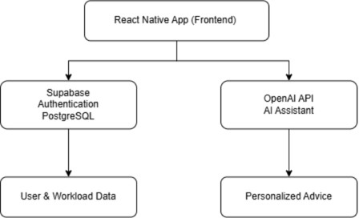

**Figure 5: Proposed System Architecture**

The React Native application uses Supabase for authentication and application data. Relevant workload information is used to generate personalised advice through the AI service. AI output is advisory, and users remain responsible for deciding whether suggested schedule changes should be applied.

### Build plan & scope:

#### Build Plan - 3 Weeks

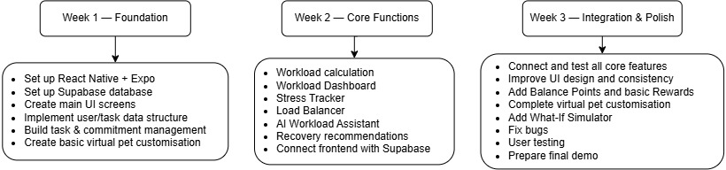

#### Core Features

| Feature | Building Scope |
| --- | --- |
| **Task & Commitment Management** | Add, edit and categorise tasks with priority, estimated duration, deadline and fixed/flexible status. |
| **Workload Dashboard** | Calculate and display overall workload across five categories. |
| **Stress Tracker** | Record stress level and basic causes. |
| **Load Balancer** | Detect overload and suggest tasks to move, postpone or reduce. |
| **AI Workload Assistant** | Provide personalized workload and planning suggestions. |
| **What-If Simulator** | Simple workload comparison before and after adding a task. |
| **Recovery System** | Recommend and record simple recovery activities. |

#### Supporting Features (Build If Time Allows)

| Feature | Building Scope |
| --- | --- |
| **Balance Points** | Basic point system for healthy workload actions. |
| **Rewards** | Limited cosmetic rewards for the virtual assistant. |
| **Mini Games** | One simple mini-game or relaxation activity. |
| **Customizable AI Companion** | The virtual pet can be customized and interactive. |

